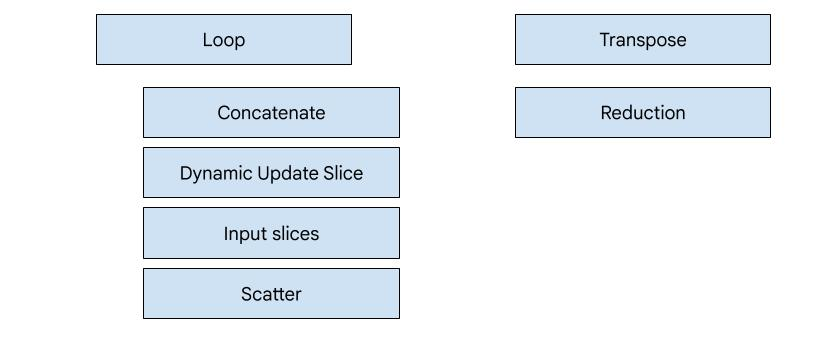
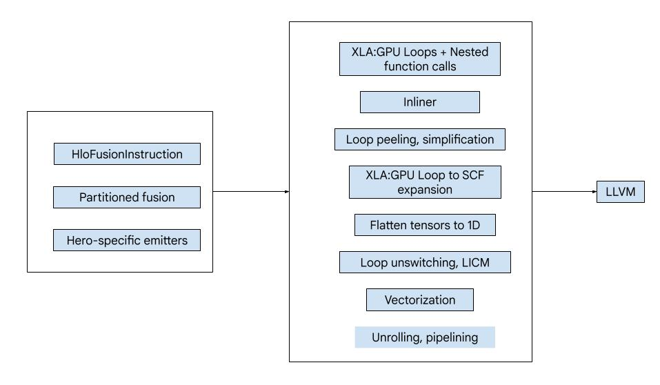
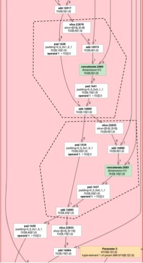
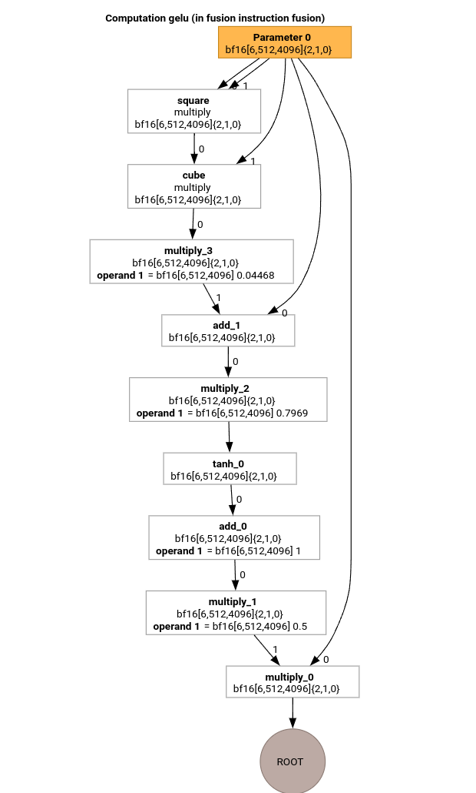
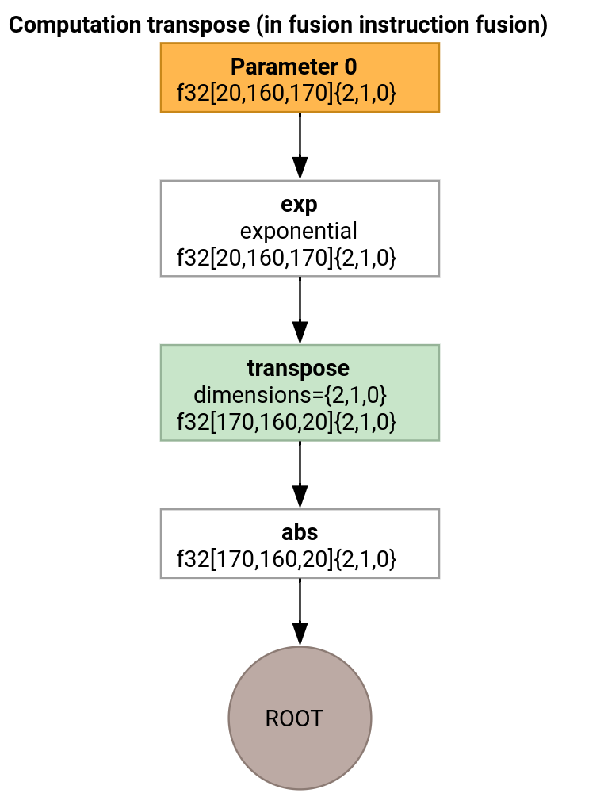

# XLA:GPU Emitters

There are three ways how to generate code for HLO in XLA:GPU.


1. Replacing HLO with custom calls to external libraries, e.g. [NVidia cuBLAS](https://developer.nvidia.com/cublas), [cuDNN](https://developer.nvidia.com/cudnn).
2. Tiling HLO to block-level and then using [OpenAI Triton](https://openai.com/index/triton/).
3. Using XLA Emitters to progressively lower HLO to LLVM IR.

This document is focused on XLA:GPU Emitters.


## Hero-based codegen

There are 7 emitter types in XLA:GPU. Each emitter type corresponds to a "hero"
of the fusion, i.e. the most important op in the fused computation that shapes
the code generation for the whole fusion.



For example, the tranpose emitter will be selected if there is a
`HloTransposeInstruction` within the fusion that requires using shared memory to
improve the memory reading and writing patterns. The reduction emitter generates
reductions using shuffles and shared memory. The loop emitter is the default
emitter. If a fusion does not have a hero for which we have a special emitter,
then the loop emitter will be used.

## High-level overview

The code consists of the following big building blocks:

- Computation partitioner - splitting an HLO fusion computation into functions
- Emitters - converting partitioned HLO fusion to MLIR (`xla_gpu`, `tensor`, `arith`, `math`, `scf` dialects)
- Compilation pipeline - optimizes and lowers IR to LLVM



## Partitioning

See [computation_partitioner.h](https://github.com/openxla/xla/blob/ca62f3e1bc9ea1d808c3a4de0a78bae7453389eb/xla/codegen/emitters/computation_partitioner.h).

Non-elementwise HLO instructions cannot always be emitted together. Consider the
following HLO graph:

```
     param
       |
      log
      |  \
      |  transpose
      |  /
      add
```

If we emit this in a single function, the `log` will be accessed at two
different indices for each element of the `add`. The old emitters solve this
problem by generating the `log` twice. For this particular graph, this is not
a problem, but when there are multiple splits, the code size grows
exponentially.

Here, we solve this problem by partitioning the graph into pieces that can be
safely emitted as one function. The criteria are:

- Instructions that have only one user are safe to emit together with their
  user.
- Instructions that have multiple users are safe to emit together with their
  users if they are accessed through the same indices by all users.

In the example above, the `add` and `tranpose` access different indices of the
`log`, so it is not safe to emit it together with them.

The graph is therefore partitioned into three functions (each containing just
one instruction).

The same is applicable to the following example with `slice` and `pad` of `add`.



## Elemental emission

See [elemental_hlo_to_mlir.h](https://github.com/openxla/xla/blob/ca62f3e1bc9ea1d808c3a4de0a78bae7453389eb/xla/codegen/emitters/elemental_hlo_to_mlir.h).

Elemental emission creates loops and math/arith ops for `HloInstructions`. For
the most part, this is straightforward, but there are some interesting things
going on here.

### Indexing transformations

Some instructions (`transpose`, `broadcast`, `reshape`, `slice`, `reverse` and
a few more) are purely transformations on indices: to produce an element of the
result, we need to produce some other element of the input. For this, we can
reuse XLA's [indexing_analysis](https://openxla.org/xla/indexing), which has
functions to produce the output to input mapping for an instruction.

For example, for a `transpose` from `[20,40]` to `[40,20]`, it will produce the
following indexing map (one affine expression per input dimension; d0 and d1 are
the output dimensions):

```
  (d0, d1) -> d1
  (d0, d1) -> d0
```

So for these pure index transformation instructions, we can simply get the map,
apply it to the output indices, and produce the input at the resulting index.

Similarly, the `pad` op uses indexing maps and constraints for most of the
implementation. `pad` is also an indexing transformation with some added checks
to see if we return an element of the input or the padding value.

### Tuples

We do not support internal `tuple`s. We also do not support nested tuple
outputs. All XLA graphs that use these features can be converted to graphs that
do not.

### Gather

We only support canonical gathers as produced by [`gather_simplifier`](
https://github.com/openxla/xla/blob/main/xla/hlo/transforms/simplifiers/gather_simplifier.h).

## Subgraph functions

For a subgraph of a computation with parameters `%p0` to `%p_n`, and subgraph
roots with rank `r` and element types (`e0` to `e_m`), we use the following MLIR
function signature:

``````
(%p0: tensor<...>, %p1: tensor<...>, ..., %pn: tensor<...>,
 %i0: index, %i1: index, ..., %i_r-1: index) -> (e0, ..., e_m)
``````

That is, we have one tensor input per computation parameter, one index input per
dimension of the output, and one result per output.

To emit a function, we simply use the elemental emitter above, and recursively
emit its operands until we reach the edge of the subgraph. Then, we:emit a
`tensor.extract` for parameters or emit a `func.call` for other subgraphs

## Entry function

Each emitter type differs in how it generates the entry function, i.e. the
function for the hero. The entry function is different from the functions above,
since it has no indices as inputs (just the thread and block IDs) and actually
needs to write the output somewhere. For the loop emitter, this is fairly
straightforward, but the transpose and reduction emitters have non-trivial write
logic.

The signature of the entry computation is:

```
(%p0: tensor<...>, ..., %pn: tensor<...>,
 %r0: tensor<...>, ..., %rn: tensor<...>) -> (tensor<...>, ..., tensor<...>)
```

Where like before, the `%pn`s are the parameters of the computation, and the
`%rn`s are the results of the computation. The entry computation takes the
results as tensors, `tensor.insert`s updates into them, and then returns them.
No other uses of the output tensors are allowed.

## Compilation pipeline

### Loop emitter

See [loop.h](https://github.com/openxla/xla/blob/cfd16b7f21feff17635c782f4489c0f478178eb9/xla/backends/gpu/codegen/emitters/loop.h#L4).

Let's study the most important passes of the MLIR compilation pipeline using the
HLO for the GELU function.



This HLO computation only has elementwise ops, constants and broadcasts. It will
be emitted using the loop emitter.

#### MLIR Conversion

After conversion to MLIR we get an `xla_gpu.loop` that depends on
`%thread_id_x` and `%block_id_x` and defines the loop that traverses all
elements of the output linearly to guarantee coalesced writes.

On every iteration of this loop we call

```
   %pure_call = xla_gpu.pure_call @gelu(%input, %dim0, %dim1, %dim2)
      : (tensor<6x512x4096xbf16>, index, index, index) -> bf16
```

to compute elements of the root operation. Note, that we have only one outlined
function for `@gelu`, because the partitioner did not detect a tensor that has 2
or more various access patterns.

```
#map = #xla_gpu.indexing_map<"(th_x, bl_x)[vector_index] -> ("
 "bl_x floordiv 4096, (bl_x floordiv 8) mod 512, (bl_x mod 8) * 512 + th_x * 4 + vector_index),"
 "domain: th_x in [0, 127], bl_x in [0, 24575], vector_index in [0, 3]">

func.func @main(%input: tensor<6x512x4096xbf16> , %output: tensor<6x512x4096xbf16>)
   -> tensor<6x512x4096xbf16> {
 %thread_id_x = gpu.thread_id  x {xla.range = [0 : index, 127 : index]}
 %block_id_x = gpu.block_id  x {xla.range = [0 : index, 24575 : index]}

 %xla_loop = xla_gpu.loop (%thread_id_x, %block_id_x)[%vector_index] -> (%dim0, %dim1, %dim2)
     in #map iter_args(%iter = %output) -> (tensor<6x512x4096xbf16>) {
   %pure_call = xla_gpu.pure_call @gelu(%input, %dim0, %dim1, %dim2)
      : (tensor<6x512x4096xbf16>, index, index, index) -> bf16
   %inserted = tensor.insert %pure_call into %iter[%dim0, %dim1, %dim2] : tensor<6x512x4096xbf16>
   xla_gpu.yield %inserted : tensor<6x512x4096xbf16>
 }
 return %xla_loop : tensor<6x512x4096xbf16>
}

func.func private @gelu(%arg0: tensor<6x512x4096xbf16>, %i: index, %j: index, %k: index) -> bf16 {
  %cst = arith.constant 5.000000e-01 : bf16
  %cst_0 = arith.constant 1.000000e+00 : bf16
  %cst_1 = arith.constant 7.968750e-01 : bf16
  %cst_2 = arith.constant 4.467770e-02 : bf16
  %extracted = tensor.extract %arg0[%i, %j, %k] : tensor<6x512x4096xbf16>
  %0 = arith.mulf %extracted, %extracted : bf16
  %1 = arith.mulf %0, %extracted : bf16
  %2 = arith.mulf %1, %cst_2 : bf16
  %3 = arith.addf %extracted, %2 : bf16
  %4 = arith.mulf %3, %cst_1 : bf16
  %5 = math.tanh %4 : bf16
  %6 = arith.addf %5, %cst_0 : bf16
  %7 = arith.mulf %6, %cst : bf16
  %8 = arith.mulf %extracted, %7 : bf16
  return %8 : bf16
}
```

#### Inliner

After `@gelu` is inlined, we get a single `@main` function. It can happen that
the same function is called twice or more. In this case we don't inline. More
details on the inlining rules can be found in
[xla_gpu_dialect.cc](https://github.com/openxla/xla/blob/cfd16b7f21feff17635c782f4489c0f478178eb9/xla/backends/gpu/codegen/ir/xla_gpu_dialect.cc).

```
func.func @main(%arg0: tensor<6x512x4096xbf16>, %arg1: tensor<6x512x4096xbf16>) -> tensor<6x512x4096xbf16> {
 ...
  %thread_id_x = gpu.thread_id  x {xla.range = [0 : index, 127 : index]}
  %block_id_x = gpu.block_id  x {xla.range = [0 : index, 24575 : index]}

  %xla_loop = xla_gpu.loop (%thread_id_x, %block_id_x)[%vector_index] -> (%dim0, %dim1, %dim2)
      in #map iter_args(%iter = %output) -> (tensor<6x512x4096xbf16>) {
    %extracted = tensor.extract %input[%dim0, %dim1, %dim2] : tensor<6x512x4096xbf16>
    %0 = arith.mulf %extracted, %extracted : bf16
    %1 = arith.mulf %0, %extracted : bf16
    %2 = arith.mulf %1, %cst : bf16
    %3 = arith.addf %extracted, %2 : bf16
    %4 = arith.mulf %3, %cst_0 : bf16
    %5 = math.tanh %4 : bf16
    %6 = arith.addf %5, %cst_1 : bf16
    %7 = arith.mulf %6, %cst_2 : bf16
    %8 = arith.mulf %extracted, %7 : bf16
    %inserted = tensor.insert %8 into %iter[%dim0, %dim1, %dim2] : tensor<6x512x4096xbf16>
    xla_gpu.yield %inserted : tensor<6x512x4096xbf16>
  }
  return %xla_loop : tensor<6x512x4096xbf16>
}
```

#### `xla_gpu` to `scf` conversion

See [lower_xla_gpu_to_scf.cc](https://github.com/openxla/xla/blob/cfd16b7f21feff17635c782f4489c0f478178eb9/xla/backends/gpu/codegen/transforms/lower_xla_gpu_to_scf.cc).

`xla_gpu.loop` represents a loop nest with a boundary check inside. If the loop
inductions variables are out of bounds of the indexing map domain, then this
iteration is skipped. It means, that the loop is converted to 1 or more nested
`scf.for` ops with an `scf.if` inside.

```
%xla_loop = scf.for %vector_index = %c0 to %c4 step %c1 iter_args(%iter = %output) -> (tensor<6x512x4096xbf16>) {
   %2 = arith.cmpi sge, %thread_id_x, %c0 : index
   %3 = arith.cmpi sle, %thread_id_x, %c127 : index
   %4 = arith.andi %2, %3 : i1
   %5 = arith.cmpi sge, %block_id_x, %c0 : index
   %6 = arith.cmpi sle, %block_id_x, %c24575 : index
   %7 = arith.andi %5, %6 : i1
   %inbounds = arith.andi %4, %7 : i1
   %9 = scf.if %inbounds -> (tensor<6x512x4096xbf16>) {
     %dim0 = xla_gpu.apply_indexing #map(%thread_id_x,  %block_id_x)[%vector_index]
     %dim1 = xla_gpu.apply_indexing #map1(%thread_id_x, %block_id_x)[%vector_index]
     %dim2 = xla_gpu.apply_indexing #map2(%thread_id_x, %block_id_x)[%vector_index]
     %extracted = tensor.extract %input[%dim0, %dim1, %dim2] : tensor<6x512x4096xbf16>
     // ... more arithmetic operations
     %29 = arith.mulf %extracted, %28 : bf16
     %inserted = tensor.insert %29 into %iter[%dim0, %dim1, %dim2] : tensor<6x512x4096xbf16>
     scf.yield %inserted : tensor<6x512x4096xbf16>
   } else {
     scf.yield %iter : tensor<6x512x4096xbf16>
   }
   scf.yield %9 : tensor<6x512x4096xbf16>
 }
```

#### Flatten tensors

See [flatten_tensors.cc](https://github.com/openxla/xla/blob/cfd16b7f21feff17635c782f4489c0f478178eb9/xla/backends/gpu/codegen/transforms/flatten_tensors.cc).

The N-d tensors are projected onto 1D. This will simplify the vectorization and
the lowering to LLVM because every tensor access now corresponds to how the data
is aligned in memory.

```
#map = #xla_gpu.indexing_map<"(th_x, bl_x, vector_index) -> (th_x * 4 + bl_x * 512 + vector_index),"
 "domain: th_x in [0, 127], bl_x in [0, 24575], vector_index in [0, 3]">

func.func @main(%input: tensor<12582912xbf16>, %output: tensor<12582912xbf16>) -> tensor<12582912xbf16> {
 %xla_loop = scf.for %vector_index = %c0 to %c4 step %c1 iter_args(%iter = %output) -> (tensor<12582912xbf16>) {
   %dim = xla_gpu.apply_indexing #map(%thread_id_x, %block_id_x, %vector_index)
   %extracted = tensor.extract %input[%dim] : tensor<12582912xbf16>
   %2 = arith.mulf %extracted, %extracted : bf16
   %3 = arith.mulf %2, %extracted : bf16
   %4 = arith.mulf %3, %cst_2 : bf16
   %5 = arith.addf %extracted, %4 : bf16
   %6 = arith.mulf %5, %cst_1 : bf16
   %7 = math.tanh %6 : bf16
   %8 = arith.addf %7, %cst_0 : bf16
   %9 = arith.mulf %8, %cst : bf16
   %10 = arith.mulf %extracted, %9 : bf16
   %inserted = tensor.insert %10 into %iter[%dim] : tensor<12582912xbf16>
   scf.yield %inserted : tensor<12582912xbf16>
 }
 return %xla_loop : tensor<12582912xbf16>
}
```

#### Vectorization

See [vectorize_loads_stores.cc](https://github.com/openxla/xla/blob/cfd16b7f21feff17635c782f4489c0f478178eb9/xla/backends/gpu/codegen/transforms/vectorize_loads_stores.cc).

The pass analyses the indices in the `tensor.extract` and `tensor.insert` ops
and if they are produced by `xla_gpu.apply_indexing` that accesses the elements
contiguously w.r.t. to the `%vector_index` and the access is aligned, then
`tensor.extract` is converted to `vector.transfer_read` and hoisted out of the
loop.

In this particular case, there is an indexing map
`(th_x, bl_x, vector_index) -> (th_x * 4 + bl_x * 512 + vector_index)` used to
compute elements to extract and insert in a `scf.for` loop from 0 to 4.
Therefore, both `tensor.extract` and `tensor.insert` can be vectorized.

```
func.func @main(%input: tensor<12582912xbf16>, %output: tensor<12582912xbf16>) -> tensor<12582912xbf16> {
 %vector_0 = arith.constant dense<0.000000e+00> : vector<4xbf16>
 %0 = xla_gpu.apply_indexing #map(%thread_id_x, %block_id_x, %c0)
 %2 = vector.transfer_read %input[%0], %cst {in_bounds = [true]} : tensor<12582912xbf16>, vector<4xbf16>
 %xla_loop:2 = scf.for %vector_index = %c0 to %c4 step %c1
     iter_args(%iter = %output, %iter_vector = %vector_0) -> (tensor<12582912xbf16>, vector<4xbf16>) {
   %5 = vector.extract %2[%vector_index] : bf16 from vector<4xbf16>
   %6 = arith.mulf %5, %5 : bf16
   %7 = arith.mulf %6, %5 : bf16
   %8 = arith.mulf %7, %cst_4 : bf16
   %9 = arith.addf %5, %8 : bf16
   %10 = arith.mulf %9, %cst_3 : bf16
   %11 = math.tanh %10 : bf16
   %12 = arith.addf %11, %cst_2 : bf16
   %13 = arith.mulf %12, %cst_1 : bf16
   %14 = arith.mulf %5, %13 : bf16
   %15 = vector.insert %14, %iter_vector [%vector_index] : bf16 into vector<4xbf16>
   scf.yield %iter, %15 : tensor<12582912xbf16>, vector<4xbf16>
 }
 %4 = vector.transfer_write %xla_loop#1, %output[%0] {in_bounds = [true]}
     : vector<4xbf16>, tensor<12582912xbf16>
 return %4 : tensor<12582912xbf16>
}
```

#### Loop unrolling

See [optimize_loops.cc](https://github.com/openxla/xla/blob/cfd16b7f21feff17635c782f4489c0f478178eb9/xla/backends/gpu/codegen/transforms/optimize_loops.cc).

The loop unrolling finds `scf.for` loops that can be unrolled. In this case, the
loop over the elements of the vector disappears.

```
func.func @main(%input: tensor<12582912xbf16>, %arg1: tensor<12582912xbf16>) -> tensor<12582912xbf16> {

  %cst_0 = arith.constant dense<0.000000e+00> : vector<4xbf16>
  %dim = xla_gpu.apply_indexing #map(%thread_id_x, %block_id_x, %c0)
  %2 = vector.transfer_read %input[%dim], %cst {in_bounds = [true]} : tensor<12582912xbf16>, vector<4xbf16>
  %3 = vector.extract %2[%c0] : bf16 from vector<4xbf16>
  ...
  %13 = vector.insert %12, %cst_0 [%c0] : bf16 into vector<4xbf16>
  %14 = vector.extract %2[%c1] : bf16 from vector<4xbf16>
  ...
  %24 = vector.insert %23, %13 [%c1] : bf16 into vector<4xbf16>
  %25 = vector.extract %2[%c2] : bf16 from vector<4xbf16>
  ...
  %35 = vector.insert %34, %24 [%c2] : bf16 into vector<4xbf16>
  %36 = vector.extract %2[%c3] : bf16 from vector<4xbf16>
  ...
  %46 = vector.insert %45, %35 [%c3] : bf16 into vector<4xbf16>
  %47 = vector.transfer_write %46, %arg1[%dim] {in_bounds = [true]} : vector<4xbf16>, tensor<12582912xbf16>
  return %47 : tensor<12582912xbf16>
}
```

#### Conversion to LLVM

We mostly use the standard LLVM lowerings, but there are a few special passes.
We cannot use the `memref` lowerings for tensors, since we don't bufferize the
IR and our ABI is not compatible with the `memref` ABI. Instead, we have a
custom lowering directly from tensors to `LLVM`.

- The lowering of tensors is done in [lower_tensors.cc](https://github.com/openxla/xla/blob/cfd16b7f21feff17635c782f4489c0f478178eb9/xla/backends/gpu/codegen/transforms/lower_tensors.cc). `tensor.extract` is
  lowered to `llvm.load`, `tensor.insert` to `llvm.store`, in the obvious way.
- [propagate_slice_indices](https://github.com/openxla/xla/blob/cfd16b7f21feff17635c782f4489c0f478178eb9/xla/backends/gpu/codegen/transforms/propagate_slice_indices.cc) and [merge_pointers_to_same_slice](https://github.com/openxla/xla/blob/cfd16b7f21feff17635c782f4489c0f478178eb9/xla/backends/gpu/codegen/transforms/merge_pointers_to_same_slice.cc) together
  implement a detail of buffer assignment and XLA's ABI: if two tensors share
  the same buffer slice, they are only passed once. These passes deduplicate the
  function arguments.


```
llvm.func @__nv_tanhf(f32) -> f32
llvm.func @main(%arg0: !llvm.ptr, %arg1: !llvm.ptr) {
  %11 = nvvm.read.ptx.sreg.tid.x : i32
  %12 = nvvm.read.ptx.sreg.ctaid.x : i32
  %13 = llvm.mul %11, %1 : i32
  %14 = llvm.mul %12, %0 : i32
  %15 = llvm.add %13, %14 : i32
  %16 = llvm.getelementptr inbounds %arg0[%15] : (!llvm.ptr, i32) -> !llvm.ptr, bf16
  %17 = llvm.load %16 invariant : !llvm.ptr -> vector<4xbf16>
  %18 = llvm.extractelement %17[%2 : i32] : vector<4xbf16>
  %19 = llvm.fmul %18, %18  : bf16
  %20 = llvm.fmul %19, %18  : bf16
  %21 = llvm.fmul %20, %4  : bf16
  %22 = llvm.fadd %18, %21  : bf16
  %23 = llvm.fmul %22, %5  : bf16
  %24 = llvm.fpext %23 : bf16 to f32
  %25 = llvm.call @__nv_tanhf(%24) : (f32) -> f32
  %26 = llvm.fptrunc %25 : f32 to bf16
  %27 = llvm.fadd %26, %6  : bf16
  %28 = llvm.fmul %27, %7  : bf16
  %29 = llvm.fmul %18, %28  : bf16
  %30 = llvm.insertelement %29, %8[%2 : i32] : vector<4xbf16>
  ...
}
```

### Transpose emitter

Let's consider a slightly more involved example.



The transpose emitter differs from the loop emitter only in how the entry
function is generated.

```
func.func @transpose(%arg0: tensor<20x160x170xf32>, %arg1: tensor<170x160x20xf32>) -> tensor<170x160x20xf32> {
  %thread_id_x = gpu.thread_id  x {xla.range = [0 : index, 127 : index]}
  %block_id_x = gpu.block_id  x {xla.range = [0 : index, 959 : index]}

  %shmem = xla_gpu.allocate_shared : tensor<32x1x33xf32>
  %xla_loop = xla_gpu.loop (%thread_id_x, %block_id_x)[%i, %j]
      -> (%input_dim0, %input_dim1, %input_dim2, %shmem_dim0, %shmem_dim1, %shmem_dim2)
      in #map iter_args(%iter = %shmem) -> (tensor<32x1x33xf32>) {
    %extracted = tensor.extract %arg0[%input_dim0, %input_dim1, %input_dim2] : tensor<20x160x170xf32>
    %0 = math.exp %extracted : f32
    %inserted = tensor.insert %0 into %iter[%shmem_dim0, %shmem_dim1, %shmem_dim2] : tensor<32x1x33xf32>
    xla_gpu.yield %inserted : tensor<32x1x33xf32>
  }

  %synced_tensor = xla_gpu.sync_threads %xla_loop : tensor<32x1x33xf32>

  %xla_loop_0 = xla_gpu.loop (%thread_id_x %block_id_x)[%i, %j] -> (%dim0, %dim1, %dim2)
      in #map1 iter_args(%iter = %arg1) -> (tensor<170x160x20xf32>) {
    // indexing computations
    %extracted = tensor.extract %synced_tensor[%0, %c0, %1] : tensor<32x1x33xf32>
    %2 = math.absf %extracted : f32
    %inserted = tensor.insert %2 into %iter[%3, %4, %1] : tensor<170x160x20xf32>
    xla_gpu.yield %inserted : tensor<170x160x20xf32>
  }
  return %xla_loop_0 : tensor<170x160x20xf32>
}
```

In this case, we generate two `xla_gpu.loop` ops. The first one performs
coalesced reads from the input and writes the result to the shared memory.

The shared memory tensor is created using `xla_gpu.allocate_shared` op.

After the threads are synchronized using `xla_gpu.sync_threads`, the second
`xla_gpu.loop` reads the elements from the shared memory tensor and performs
coalesced writes to the output.

### Reproducer

In order to see the IR after every pass of the compilation pipeline, one can launch `run_hlo_module` with the `--v=5` flag.

```
run_hlo_module --platform=CUDA --xla_disable_all_hlo_passes --reference_platform="" --v=5 /tmp/gelu.hlo
```

where `/tmp/gelu.hlo` contains

```
HloModule m:

gelu {
  %param = bf16[6,512,4096] parameter(0)
  %constant_0 = bf16[] constant(0.5)
  %bcast_0 = bf16[6,512,4096] broadcast(bf16[] %constant_0), dimensions={}
  %constant_1 = bf16[] constant(1)
  %bcast_1 = bf16[6,512,4096] broadcast(bf16[] %constant_1), dimensions={}
  %constant_2 = bf16[] constant(0.79785)
  %bcast_2 = bf16[6,512,4096] broadcast(bf16[] %constant_2), dimensions={}
  %constant_3 = bf16[] constant(0.044708)
  %bcast_3 = bf16[6,512,4096] broadcast(bf16[] %constant_3), dimensions={}
  %square = bf16[6,512,4096] multiply(bf16[6,512,4096] %param, bf16[6,512,4096] %param)
  %cube = bf16[6,512,4096] multiply(bf16[6,512,4096] %square, bf16[6,512,4096] %param)
  %multiply_3 = bf16[6,512,4096] multiply(bf16[6,512,4096] %cube, bf16[6,512,4096] %bcast_3)
  %add_1 = bf16[6,512,4096] add(bf16[6,512,4096] %param, bf16[6,512,4096] %multiply_3)
  %multiply_2 = bf16[6,512,4096] multiply(bf16[6,512,4096] %add_1, bf16[6,512,4096] %bcast_2)
  %tanh_0 = bf16[6,512,4096] tanh(bf16[6,512,4096] %multiply_2)
  %add_0 = bf16[6,512,4096] add(bf16[6,512,4096] %tanh_0, bf16[6,512,4096] %bcast_1)
  %multiply_1 = bf16[6,512,4096] multiply(bf16[6,512,4096] %add_0, bf16[6,512,4096] %bcast_0)
  ROOT %multiply_0 = bf16[6,512,4096] multiply(bf16[6,512,4096] %param, bf16[6,512,4096] %multiply_1)
}

ENTRY main {
  %param = bf16[6,512,4096] parameter(0)
  ROOT fusion = bf16[6,512,4096] fusion(%param), kind=kLoop, calls=gelu
}
```


## Links to code

* Compilation pipeline: [emitter_base.h](https://github.com/openxla/xla/blob/cfd16b7f21feff17635c782f4489c0f478178eb9/xla/backends/gpu/codegen/emitters/emitter_base.h)
* Optimization and conversion passes: [backends/gpu/codegen/transforms](https://github.com/openxla/xla/tree/cfd16b7f21feff17635c782f4489c0f478178eb9/xla/backends/gpu/codegen/transforms)
* Partition logic: [computation_partitioner.h](https://github.com/openxla/xla/blob/ca62f3e1bc9ea1d808c3a4de0a78bae7453389eb/xla/codegen/emitters/computation_partitioner.h)
* Hero-based emitters: [backends/gpu/codegen/emitters](https://github.com/openxla/xla/tree/cfd16b7f21feff17635c782f4489c0f478178eb9/xla/backends/gpu/codegen/emitters)
* XLA:GPU ops: [xla_gpu_ops.td](https://github.com/openxla/xla/blob/cfd16b7f21feff17635c782f4489c0f478178eb9/xla/backends/gpu/codegen/ir/xla_gpu_types.td)
* Correctness and lit tests: [gpu/fusions/tests](https://github.com/openxla/xla/tree/925722533aa2ca55219f5c88c1ec333f4e1cbd7c/xla/service/gpu/fusions/tests)
